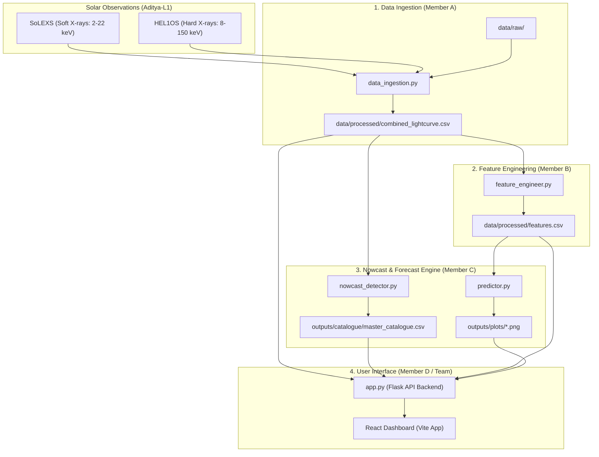

# System Architecture

The pipeline is organized as an end-to-end, modular data pipeline where each component has clear boundaries and complies with the **Day-1 Data Handoff Contract**.

## Data Flow Diagram

## Architectural Components

1. **Data Ingestion Module (`data_ingestion.py`)**: Responsible for reading raw telemetry files, performing coordinate/timestamp alignment, resampling to a common cadence (e.g., 10-second intervals), and outputting `combined_lightcurve.csv`.
2. **Feature Engineering Module (`feature_engineer.py`)**: Computes physical indicators from the raw fluxes. It outputs `features.csv` which contains normalized ratios, derivatives, trends, and target prediction labels.
3. **Nowcasting Detector (`nowcast_detector.py`)**: Computes running backgrounds, applies threshold triggers, finds the onset, peak, and decay of flares, and logs them in `master_catalogue.csv`.
4. **Forecasting Predictor (`predictor.py`)**: Reads engineered features, trains supervised classification models (Random Forest), generates future flare warnings, and evaluates them using precision-recall metrics.
5. **Interactive Dashboard (`/backend/` & `/frontend/`)**: Powered by a Python Flask API backend and a React + Vite + TypeScript frontend. It features real-time Recharts telemetry plotting, an interactive Neupert Effect simulation playground, orbital geometry visualizations, and proposal documentation viewers.
