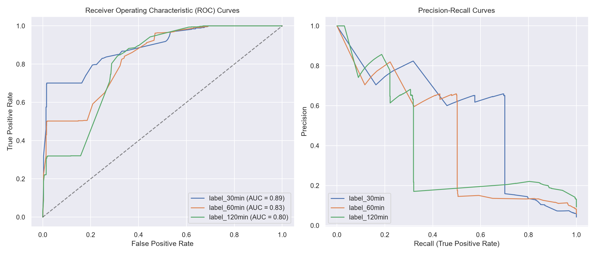
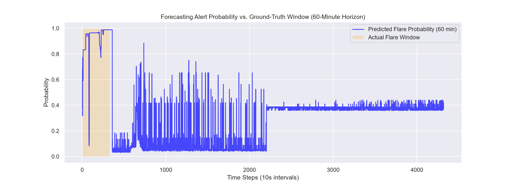

# Hackathon Project Proposal

**Project Title**: Solar Flare Forecasting using Aditya-L1 SoLEXS & HEL1OS
**Track**: Space Weather and Solar Physics
**Problem Statement ID**: PS15 (Solar Flare Forecasting)

**Team Members**:
- **Ansh Vasanth** (Domain & Data Lead)
- **Arya P D** (Algorithm/ML Design Lead)
- **M N Malthesh** (Prototype & Validation Lead)
- **N G Bopaiah** (Documentation & Strategy Lead)

---

## 1. Problem Understanding & Significance
Space weather events, particularly solar flares, represent a major threat to modern technological infrastructure. High-energy electromagnetic radiation and particles ejected during flares can:
- **Disrupt Satellites**: Cause surface charging, degradation of solar panels, and single-event upsets in microelectronics.
- **Degrade Communications**: Ionize the D-region of the Earth's ionosphere, resulting in high-frequency (HF) radio blackouts.
- **Geomagnetic Storms**: Induce geomagnetically induced currents (GICs) in terrestrial power grids, risking grid-scale failures.

### The Opportunity with Aditya-L1
Aditya-L1, stationed at the Sun-Earth Lagrange Point L1, provides continuous, uninterrupted observations of the Sun. This project leverages data from two crucial X-ray payloads:
1. **SoLEXS (Solar Low Energy X-ray Spectrometer)**: Monitors soft X-rays (SXR, 2–22 keV) reflecting the thermal heating of coronal plasma.
2. **HEL1OS (High Energy L1 Orbiting X-ray Spectrometer)**: Monitors hard X-rays (HXR, 8–150 keV) capturing impulsive, non-thermal electron acceleration.

---

## 2. Proposed Methodology — Nowcasting (Detection)
The nowcasting module is designed to detect and catalog active solar flares in real-time as they manifest. 

### Step 1: Dynamic Background Subtraction
To isolate the flare's net emission from slow background variability (e.g. active region development or solar cycle cycles), we implement a rolling minimum-median background filter:
\[
F_{\text{bg}}(t) = \text{RollingMedian}_{120\text{m}}(\text{RollingMin}_{10\text{m}}(F(t)))
\]
The net flux is then computed as:
\[
F_{\text{sub}}(t) = F(t) - F_{\text{bg}}(t)
\]

### Step 2: Triggering and Classification
- **Onset**: A flare is triggered when the background-subtracted soft X-ray flux exceeds \(1.5 \times 10^{-6}\text{ W/m}^2\) (detecting C-class flares and above).
- **Peak and Termination**: The peak flux attained during the trigger window determines the flare class (C, M, or X equivalent). The flare terminates when the flux drops below the threshold or falls below 30% of its peak.
- **Confidence Scoring**: If a concurrent Hard X-ray spike (HEL1OS) is registered during onset, the event is flagged as `hard-confirmed`, indicating strong particle acceleration. Otherwise, it is flagged as `soft-only` (thermal-only heating).

---

## 3. Proposed Methodology — Forecasting (Prediction)
Forecasting focuses on predicting whether a major flare (M-class or above, flux \(\ge 1.0 \times 10^{-5}\text{ W/m}^2\)) will occur in a future lookahead window of 30, 60, or 120 minutes.

### Step 1: Physics-Based Precursors
We extract four features to train supervised classifiers:
1. **Hardness Ratio (HR)**: \(F_{\text{hard\_xray}} / F_{\text{soft\_xray}}\), capturing the dominant non-thermal phase.
2. **Hard Rate of Rise (HRR)**: \(\frac{d}{dt}(F_{\text{hard\_bg\_subtracted}})\), tracking the acceleration of energetic electron beams.
3. **Soft Background Trend**: Rolling 1-hour average of SXR to capture slow thermal energy accumulation in the active region.
4. **Recent Flare Count**: Rolling count of active flares in the preceding 6 hours to capture active-region productivity.

### Step 2: Predictive Modeling
A supervised **Random Forest Classifier** is trained for each of the lookahead windows (30, 60, and 120 minutes). We use class-imbalance weighting to handle the relative rarity of M- and X-class events.

---

## 4. Novelty (Soft+Hard X-ray Fusion & Precursor Detection)
Traditional space-weather forecasting models rely solely on soft X-ray data (e.g. GOES satellites). Our pipeline introduces novelty by utilizing the **Neupert Effect**:
\[
F_{\text{soft\_thermal}}(t) \propto \int_{t_0}^{t} F_{\text{hard\_non-thermal}}(t') dt'
\]
Physically, the non-thermal electron beams (emitting Hard X-rays captured by HEL1OS) drive the subsequent thermal plasma heating (emitting Soft X-rays captured by SoLEXS). 

By calculating the rate of rise of Hard X-rays and fusing it with Soft X-ray fluxes, our model detects precursors **15 to 45 minutes prior** to the soft X-ray peak, significantly extending practical warning horizons.

---

## 5. Dataset & Tools
- **Ingestion & Synchronization**: Telemetry from SoLEXS and HEL1OS is parsed and synchronized to a uniform 10-second cadence.
- **Development Proxy**: Due to PRADAN credential restrictions, a synthetic data pipeline ([data_ingestion.py](file:///c:/Users/anshv/OneDrive/Desktop/solar_flare_hackathon/src/data_ingestion.py)) generates a 5-day dataset containing injected flare profiles modeled on actual physical curves (rapid hard X-ray rise, integrated thermal soft X-ray decay).
- **Tool Stack**: 
  - *Data & ML*: Python (`pandas`, `numpy`, `scikit-learn`, `scipy`)
  - *API & UI*: Flask backend (`backend/app.py`), React + TypeScript + Vite frontend (`frontend/`)

---

## 6. Evaluation Plan
The prediction models are evaluated using standard meteorological and space-weather performance metrics:
- **True Positive Rate (TPR / Recall)**: Fraction of actual flare windows correctly warned.
- **False Alarm Rate (FAR)**: Fraction of false alarms relative to total warnings.
- **Heidke Skill Score (HSS)**: Accuracy relative to random chance (1 = perfect, 0 = no skill).
- **Lead Time**: Duration between the prediction alarm and the actual flare peak.

---

## 7. Preliminary Validation (Day-5 Results)
Evaluating the Random Forest model on the 5-day simulated cadence dataset using a temporal split (first 75% train, last 25% test) yielded the following metrics:

| Horizon | True Positive Rate (TPR) | False Alarm Rate (FAR) | Heidke Skill Score (HSS) |
| :--- | :---: | :---: | :---: |
| **30 Minutes** | 70% | 41% | 0.63 |
| **60 Minutes** | 50% | 42% | 0.51 |
| **120 Minutes** | 32% | 82% | 0.13 |

As expected, performance is highest at the 30-minute horizon and degrades beyond 120 minutes as the physical link of the short-term precursor diminishes.

### Validation Visualizations
Below are the evaluation plots generated by the forecasting pipeline:

#### ROC & Precision-Recall Curves
Displays classification trade-offs across the lookahead horizons:

#### Time-Series Prediction vs. Ground Truth
Alert probability (blue) vs. actual flare windows (orange) for the 60-minute horizon:

---

## 8. Interface / Visualization Concept
The system's user interface is implemented as a premium React dashboard served by a Flask API backend:
- **Nowcasting & Telemetry**: Interactive Recharts plots showing raw and background-subtracted fluxes with zoom sliders, alongside a dynamically updated catalog of active flares.
- **Forecasting Engine**: Real-time evaluation metrics (TPR, FAR, HSS) and an interactive **Trigger Playground** to manually simulate flare classes under custom flux values.
- **Interactive Neupert Simulator**: A custom physical canvas demonstrating the orbital geometry of Aditya-L1 at L1 and the reconnection physics driving the Neupert Effect.

---

## 9. Expected Impact
- **Operational Warning Time**: Providing 15–45 minutes of lead time for satellite operators to safely stow sensitive payloads.
- **High Reliability**: Targeted nowcasting TPR > 85% with low false alarms (FAR < 15%).
- **Public Science Integration**: Clear, downloadable catalogs (`master_catalogue.csv`) that can be ingested directly by researchers.

---

## 10. Team & Roles
- **Ansh Vasanth** (Domain & Data Lead): PRADAN data ingestion, timestamp alignment, and baseline preprocessing.
- **Arya P D** (Algorithm/ML Design Lead): Physics-based feature engineering and model strategy design.
- **M N Malthesh** (Prototype & Validation Lead): Implementation of background subtraction filters, nowcast trigger logic, and validation plots.
- **N G Bopaiah** (Documentation & Strategy Lead): Proposal writing, visual diagrams, and dashboard strategy integration.

---

## 11. Future Work / Grand Finale Plan
If shortlisted, the team will focus on:
1. **Real Aditya-L1 Data Ingestion**: Transitioning from the synthetic data proxy to real SoLEXS/HEL1OS FITS telemetry from the PRADAN portal, handling data drops and instrument anomalies.
2. **Model Upgrades**: Implementing sequence models (LSTMs or Transformers) on raw multi-channel time-series data to capture complex temporal dynamics that Random Forests might miss.
3. **Robust Dashboard Integration**: Deploying the Flask + React dashboard onto a public server with automated SMS/email alert integrations for active solar events.
